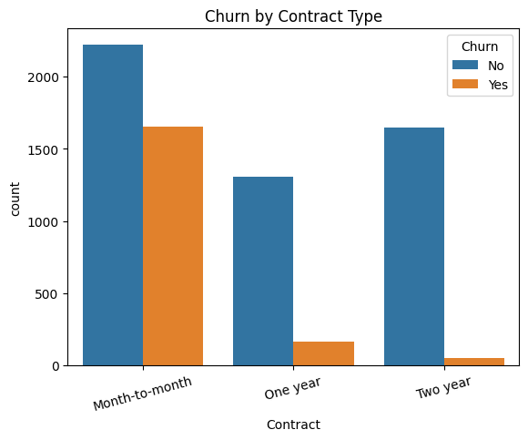
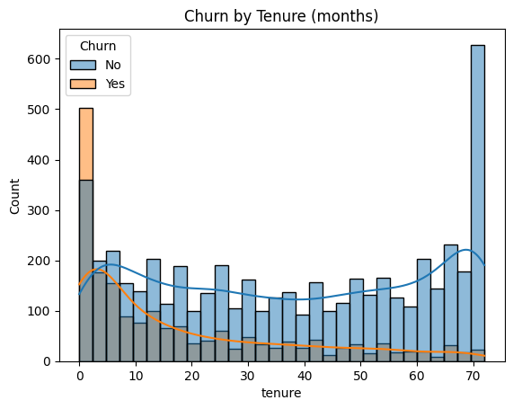
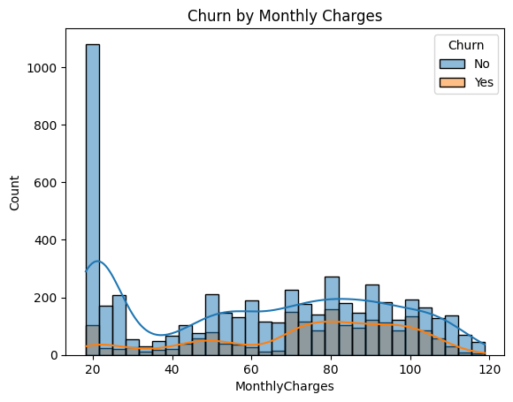
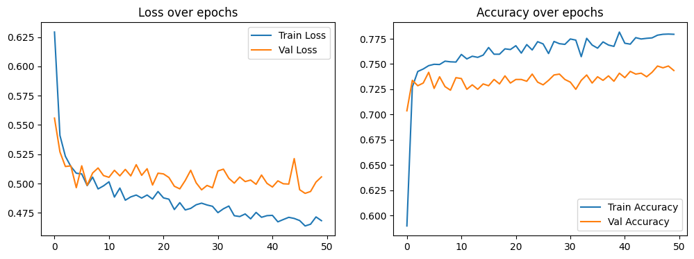
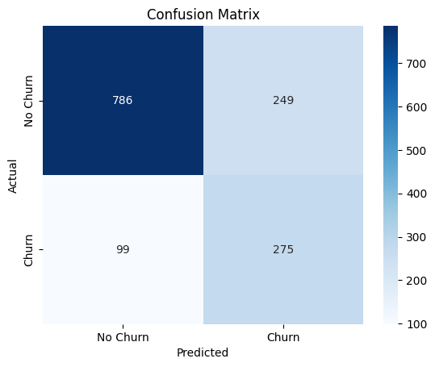
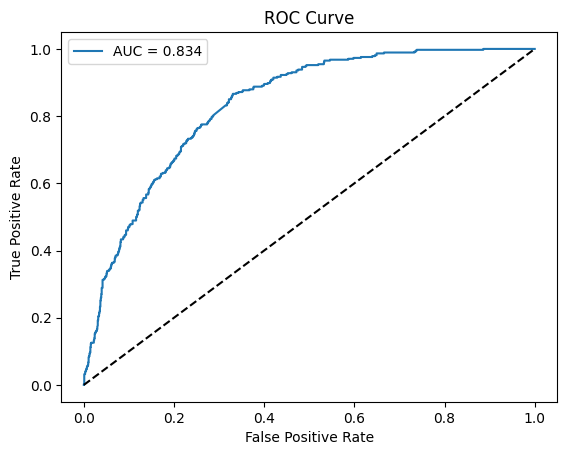

# 📉 Customer Churn Prediction using Artificial Neural Networks (ANN)

Predicting which telecom customers are likely to cancel their subscription (churn), using a deep learning ANN built with TensorFlow/Keras — including full EDA, preprocessing, class-imbalance handling, and evaluation beyond plain accuracy.

---

## 📌 Problem Statement

Customer churn — when a customer stops using a company's service — directly hurts revenue, and acquiring a new customer costs far more than retaining an existing one. This project builds a binary classification model that predicts whether a customer will churn, based on their account details, services subscribed, and billing information, so a business could proactively target at-risk customers with retention offers.

---

## 🗂️ Dataset

- **Source:** [IBM Telco Customer Churn Dataset](https://raw.githubusercontent.com/IBM/telco-customer-churn-on-icp4d/master/data/Telco-Customer-Churn.csv)
- **Size:** 7,043 customers, 21 features
- **Target:** `Churn` (Yes/No) — 26.5% churn rate (imbalanced)
- **Features include:** tenure, contract type, monthly charges, total charges, internet service, payment method, and other subscribed services (tech support, streaming, online security, etc.)

---

## 🔍 Exploratory Data Analysis

**Overall churn rate** — about 1 in 4 customers churn, confirming class imbalance that had to be addressed during training.


**Churn by contract type** — month-to-month customers churn far more than customers locked into 1-year or 2-year contracts.



**Churn by tenure** — newer customers (low tenure) are much more likely to churn than long-time customers.



**Churn by monthly charges** — customers paying higher monthly bills churn more often.



### Key insight
Churn is driven mainly by **contract type, tenure, and monthly charges** — customers who are new, on month-to-month plans, and paying more are the highest-risk group.

---

## 🛠️ Preprocessing

- Dropped `customerID` (identifier, not predictive)
- Fixed `TotalCharges` (was stored as text, coerced to numeric, filled missing values with 0 for new customers)
- One-hot encoded all categorical features
- Split data 80/20 with stratified sampling to preserve the churn ratio in both sets
- Standardized numerical features with `StandardScaler` (fit on train only, to avoid data leakage)
- Handled the ~26% class imbalance using **class weighting** during training, so the model doesn't just default to predicting the majority class

---

## 🧠 Model Architecture

A fully-connected ANN built in TensorFlow/Keras:

```
Input Layer        → number of features after encoding
Dense(32, ReLU)     → hidden layer 1
Dropout(0.3)
Dense(16, ReLU)     → hidden layer 2
Dropout(0.3)
Dense(1, Sigmoid)   → output probability of churn
```

- **Optimizer:** Adam
- **Loss:** Binary Crossentropy
- **Class weighting:** applied to counter class imbalance
- **Regularization:** Dropout (0.3) after each hidden layer to prevent overfitting
- **Training:** 50 epochs, batch size 32, with a validation split to monitor overfitting

**Training history (loss & accuracy over epochs):**



---

## 📊 Results

Accuracy alone is misleading here since the dataset is imbalanced — a model predicting "No Churn" for everyone would score ~74% accuracy while catching zero actual churners. The evaluation below focuses on precision, recall, F1, and ROC-AUC instead.

| Metric | No Churn | Churn |
|---|---|---|
| Precision | 0.89 | 0.52 |
| Recall | 0.76 | **0.74** |
| F1-score | 0.82 | 0.61 |

**Overall accuracy:** 75% | **ROC-AUC:** **0.834**

The model catches **74% of actual churners** (recall) — which matters most in this business context, since missing an at-risk customer (and not offering them a retention deal) is more costly than a false alarm.

**Confusion Matrix:**



**ROC Curve (AUC = 0.834):**



### Top churn drivers (by correlation with target)

| Increases churn risk | Reduces churn risk |
|---|---|
| Fiber optic internet (+0.31) | Long tenure (−0.35) |
| Electronic check payment (+0.30) | 2-year contract (−0.30) |
| High monthly charges (+0.19) | No internet service (−0.23) |
| Paperless billing (+0.19) | High total charges (−0.20) |
| Senior citizen (+0.15) | — |

---

## 🧰 Tech Stack

`Python` · `TensorFlow / Keras` · `Pandas` · `NumPy` · `Scikit-learn` · `Matplotlib` · `Seaborn` · `Google Colab`

---

## 📁 Repository Structure

```
churn-prediction-ann/
│
├── README.md
├── requirements.txt
├── data/
│   └── Telco-Customer-Churn.csv
├── notebooks/
│   └── churn_prediction.ipynb
├── models/
│   ├── churn_ann_model.h5
│   └── scaler.pkl
└── images/
    ├── churn_distribution.png
    ├── churn_by_contract.png
    ├── churn_by_tenure.png
    ├── churn_by_monthly_charges.png
    ├── training_history.png
    ├── confusion_matrix.png
    └── roc_curve.png
```

---

## ▶️ How to Run

```bash
git clone https://github.com/<your-username>/churn-prediction-ann.git
cd churn-prediction-ann
pip install -r requirements.txt
jupyter notebook notebooks/churn_prediction.ipynb
```

Or open `notebooks/churn_prediction.ipynb` directly in Google Colab and run all cells.

---

## 🔮 Future Improvements

- Hyperparameter tuning with Keras Tuner / Optuna
- Model explainability with SHAP to explain individual predictions
- Deploy as a REST API (FastAPI) with a Streamlit dashboard for live churn scoring
- Experiment with threshold tuning (instead of default 0.5) to optimize for business cost of false negatives vs false positives

---

## 📝 Summary

Built an ANN to predict customer churn on the Telco dataset. EDA showed churn is driven mainly by contract type, tenure, and monthly charges. Categorical features were one-hot encoded, numerical features scaled, and the ~26% class imbalance was handled using class weights. The ANN (2 hidden layers with dropout) was evaluated using precision/recall/F1 and ROC-AUC rather than accuracy alone, achieving an **AUC of 0.834** and catching **74% of actual churners**.
